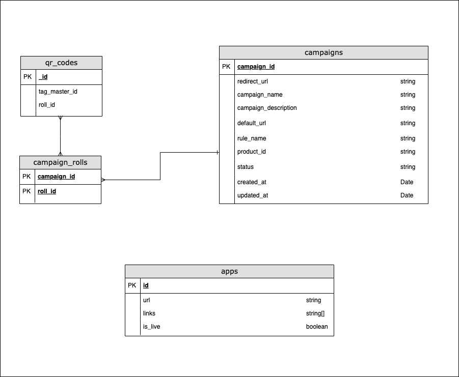

<h1>Smart Codes & Live Apps</h1>

<h2>Introduction</h2>

  Phygiworld is a startup that transforms QR Codes into smart QR codes. 
  Standard QR codes are connected to static web URLs (e.g. https://mysite.com).
  With Phygiworld, instead, each QR code can load dynamic URLs that can be changed even after the QR is printed.

 Phygiworld manages QR codes in "rolls". Rolls are groups of several unique QR codes, each of them identified by a unique ID.
 Furthermore, Phygiworld has "campaigns" to manage one or more of these rolls and define its redirection rules.
 Each campaign has a status (running or stopped). 
 If the campaign is "running", the system redirects the users to "redirect_url".
 If the campaign is "stopped", the system redirects the users to "default_url".

<h2>Exercise 1</h2>

  You are tasked to implement the core middleware endpoint that runs when a user scans a QR code. 
  This function receives the QR code ID as an input and should redirect to the URL that
  is configured in the related campaign.

  Edit the index.js file and implement the <b>"/scan/:codeId"</b> endpoint so that it redirects to the correct URL defined in the campaign (redirect_url).
  Use the available repositories to query data in the database as needed. The repositories are already imported in the index.js file. 
  All data is mocked and stored in JSON files in the mock_data directory.
  Below is a schema of the database tables.

  

You can run the script using

<pre>node index.js</pre>

You can test the API by opening:

<a href="http://localhost:4000/scan/4Ns_mH4a">http://localhost:4000/scan/4Ns_mH4a</a>

<h3>Expected Output</h3>

1. http://localhost:4000/scan/4Ns_mH4a should redirect to https://proqure-app.com/wine-brand/educational/premium-wine-2020
2. http://localhost:4000/scan/ABw0T6Vk should redirect to https://wine-brand-abc.com/ (the campaign is stopped so it redirects to the default_url)
3. http://localhost:4000/scan/uXlsA0F4 should redirect to https://proqure-app.com/wine-brand/survey/premium-wine-2020-feedback

<h2>Exercise 2</h2>

  Edit the file cron.js and implement the calculateIsLive() function.

This function needs to determine if an app is live or not.
An app is defined by its main URL, which is also referenced in the campaigns.

An app is live in two cases:

  <ul>
    <li>if the campaign that redirects to the app is live (status = "running").</li>
    <li>if another app is live and links to it</li>
  </ul>

Note that campaigns only reference apps by their links (not by their IDs).
For example, campaign 195 redirects to app 1 because it redirects to the same URL https://proqure-app.com/wine-brand/educational/premium-wine-2020.

<h3>Expected Output</h3>

1. App 1 is LIVE because App 2 is live and links to App 1
2. App 2 is LIVE because campaign 195 links to it and is running.
3. App 3 is LIVE because campaign 196 links to it and is running.
4. App 4 is LIVE because App 2 is live and links to App 4 (even though there is no running campaigns that directly link to it)
5. App 5 is LIVE because App 4 is live and links to App 5 (even though there is no running campaigns that directly link to it)
6. App 6 is NOT LIVE

<h3>Important Note</h3>

Consider Big-O factor when implementing this algorithm.
How will your function perform at scale (e.g. when the apps list has millions of elements)?

